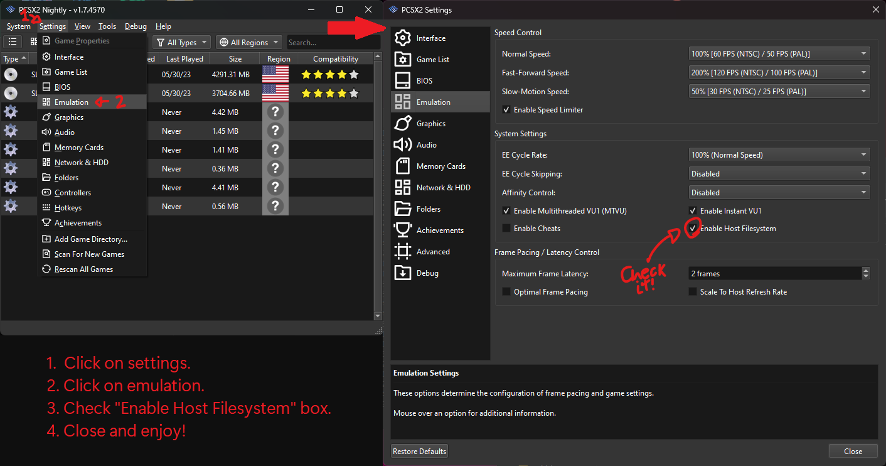

<h1 align="center">Sonic themed Infinite Runner PS2</h1>

### Sobre

Um jogo de corrida infinita no estilo do icônico ouriço azul. Inspirado no “T‑Rex Game” do Chrome, mas com a velocidade e os anéis do Sonic.

Projeto originalmente criado em **JavaScript & TypeScript** com a biblioteca [Kaplayjs](https://github.com/kaplayjs/kaplay), recriado para a engine [AthenaEnv](https://github.com/DanielSant0s/AthenaEnv), trazendo a experiência de um endless runner simples, porém com mecânicas inspiradas nos clássicos jogos do Sonic.

### O jogo conta com dois modos distintos

- **Modo Infinito**  
  Inspirado na mecânica de Flappy Bird/T‑Rex Game: desvie de obstáculos enquanto coleta pontos. A dificuldade aumenta progressivamente, com a velocidade do jogo se intensificando conforme o avanço, exigindo reflexos cada vez mais apurados.

- **Modo Normal**  
  Versão infinita sem aumento de dificuldade, mantendo velocidade constante. Ideal para praticar e se familiarizar com controles e mecânicas antes de encarar o modo Infinito.

## Como Jogar?

- No emulador **PCSX2**: ative “Sistema de Arquivos do Host” em Configurações > Emulação.  
  Em seguida, execute o `athena.elf` na pasta do jogo.

- No hardware original: execute o `athena.elf` normalmente via **uLaunchELF**.

## Controles

| Botão | Função            |
|------:|-------------------|
| X     | Pular             |
| ▲     | Selecionar opção  |
| ▼     | Selecionar opção  |
| START | Confirmar opção   |

## Status do Projeto

- Jogabilidade principal: 100%
- Melhorias (fundos, código, etc.): 100%
- Estado: finalizado nesta versão (v1.8.4)

## Links

- (**Play-Game-Web**) https://jslegend.itch.io/sonic-ring-run

- (**Gameplay(Tutorial)-Youtube-Web**) https://youtu.be/pAoXi98iJJ4?si=_AZ0OcRQht6ymp7d

- (**Githud Versão(Web)**) https://github.com/JSLegendDev/sonic-runner

- (**Githud Versão(PS2)**) https://github.com/DevWill-hub/Sonic-Infinite-Runner-PS2

## Créditos

- [AthenaEnv](https://github.com/DanielSant0s/AthenaEnv): engine utilizada para a criação de aplicativos e jogos em JS para o PlayStation 2, por [DanielSantos](https://github.com/DanielSant0s).
- Versão original(Web): criada por [JSLegendDev](https://github.com/JSLegendDev)
- Fonte utilizada: [ManiaFont](https://www.dafont.com/mania.font)
- Versão(PS2): desenvolvida por mim [Dev Will](https://github.com/DevWill-hub)
